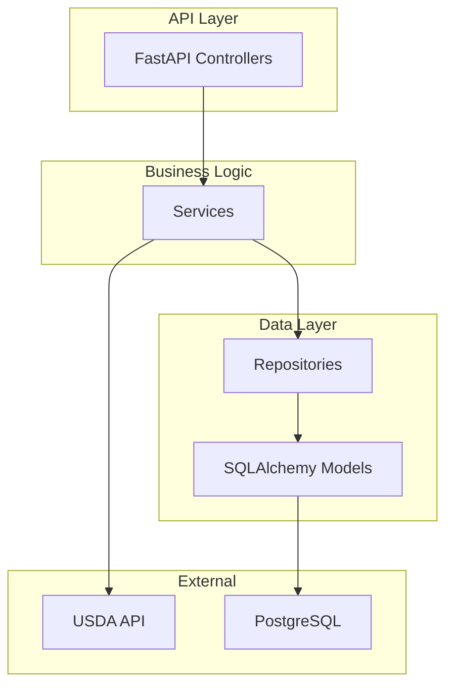
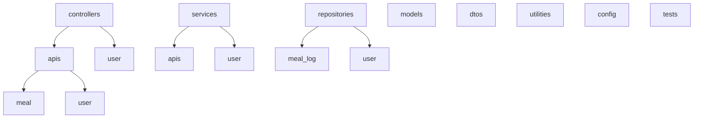
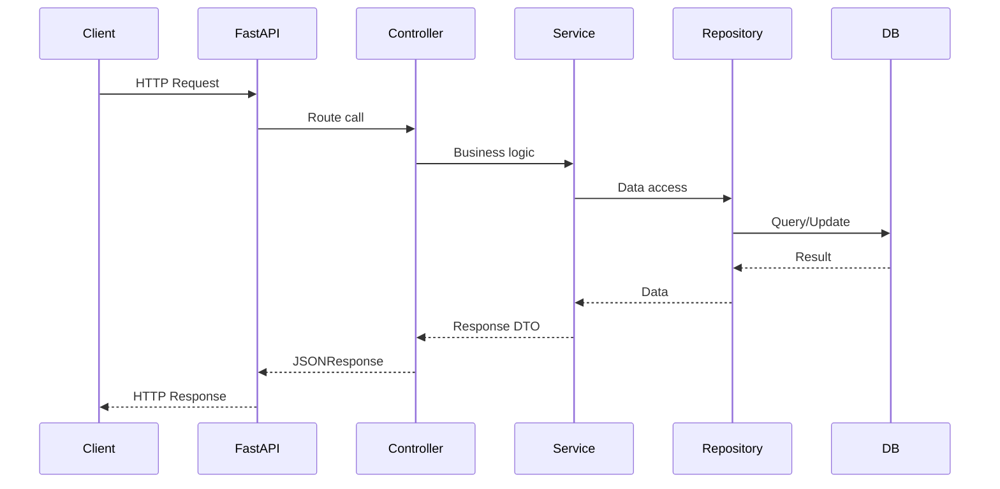

# Developer Documentation

## Project Structure

```
calcount/
├── abstractions/         # Abstract base classes and interfaces for controllers, services, repositories, and utilities. Promotes code reuse and enforces contracts.
│   ├── controller.py     # Base controller class/interface
│   ├── error.py          # Base error/exception classes
│   ├── factory.py        # Factory patterns for object creation
│   ├── model.py          # Abstract data models
│   ├── repository.py     # Base repository interface
│   ├── service.py        # Base service interface
│   └── utility.py        # Abstract utility classes
├── alembic/              # Alembic migration scripts and configuration for database schema management
│   ├── env.py            # Alembic environment setup
│   ├── versions/         # Auto-generated migration scripts
│   └── ...
├── config/               # Static configuration files (JSON, YAML, etc.)
│   ├── db/               # Database connection/configuration
│   └── usda/             # USDA API configuration
├── configurations/       # Python modules for loading and managing configuration
│   ├── db.py             # Database config loader
│   └── usda.py           # USDA config loader
├── constants/            # Constant values used throughout the app
│   ├── api_lk.py         # API lookup keys
│   ├── api_status.py     # API status codes/messages
│   ├── db/               # Database table names, etc.
│   ├── payload_type.py   # Payload type constants
│   └── regular_expression.py # Regex patterns
├── controllers/          # FastAPI route controllers (handle HTTP requests)
│   ├── apis/             # API versioned controllers (e.g., v1)
│   │   ├── meal/         # Meal-related endpoints (add, fetch, history, etc.)
│   │   └── user/         # User-related endpoints (login, register, logout, etc.)
│   └── ...
├── dependencies/         # FastAPI dependency providers (e.g., for DI, DB sessions)
├── dtos/                 # Data Transfer Objects (request/response schemas)
│   ├── requests/         # Request DTOs (organized by API and user)
│   ├── responses/        # Response DTOs
│   └── ...
├── errors/               # Custom error/exception classes for API and business logic
├── middlewares/          # FastAPI middleware (authentication, rate limiting, request context, etc.)
├── models/               # SQLAlchemy ORM models (database tables)
├── repositories/         # Database access layer (CRUD operations, queries)
│   ├── meal_log.py       # Meal log repository
│   └── user.py           # User repository
├── services/             # Business logic layer (application services)
│   ├── apis/             # API-specific services (e.g., meal add/fetch)
│   └── user/             # User-related services (login, logout, register)
├── tests/                # Unit and integration tests
│   ├── services/         # Service layer tests
│   └── ...
├── utilities/            # Utility/helper functions and classes
│   ├── dictionary.py     # Dictionary utilities
│   └── jwt.py            # JWT token utilities
├── app.py                # FastAPI app entry point (creates app, adds routers, middleware)
├── start_utils.py        # Startup utilities (config loading, logger setup, etc.)
├── requirements.txt      # Python dependencies
├── Dockerfile            # Docker build file for containerization
├── docker-compose.yml    # Docker Compose config for multi-container setup
└── README.md             # Project documentation
```

---

## Getting Started

### Prerequisites
- Python 3.10+
- PostgreSQL (or your chosen DB)
- [Optional] Docker & Docker Compose

### Installation

1. **Clone the repository:**
   ```bash
   git clone https://github.com/yourusername/calcount.git
   cd calcount
   ```
2. **Set up a virtual environment:**
   ```bash
   python -m venv venv
   source venv/bin/activate
   ```
3. **Install dependencies:**
   ```bash
   pip install -r requirements.txt
   ```
4. **Configure environment variables:**
   - Copy `.env.example` to `.env` and fill in the required values.
5. **Run database migrations:**
   ```bash
   alembic upgrade head
   ```
6. **Start the application:**
   ```bash
   uvicorn app:app --reload
   ```
7. **Access the API docs:**
   - Visit [http://localhost:8003/docs](http://localhost:8000/docs) for Swagger UI.

---

## Contributing

We welcome contributions! To get started:

1. Fork the repository.
2. Create a new branch for your feature or bugfix.
3. Write clear, well-documented code and tests.
4. Run all tests before submitting.
5. Open a pull request with a clear description of your changes.

Please follow our code style and ensure all new code is covered by tests.

---

## Architecture Overview



---

## Directory Structure (Diagram)



---

## Common Commands

- **Run the app:** `python app.py`
- **Run tests:** `pytest`
- **Run migrations:** `alembic upgrade head`
- **Create migration:** `alembic revision --autogenerate -m "message"`
- **Format code:** `black .`

---

## FAQ

**Q: Where do I add a new API endpoint?**  
A: In the appropriate controller under `controllers/apis/v1/`.

**Q: How do I add a new model?**  
A: Define it in `models/`, add a migration, and update the repository.

**Q: How do I configure rate limiting?**  
A: Set the relevant environment variable in your `.env` file.

---

## Request Flow



---

## Contact

For questions or support, open an issue or contact the maintainer at [sengarsinghshreyansh@gamil.com].

---